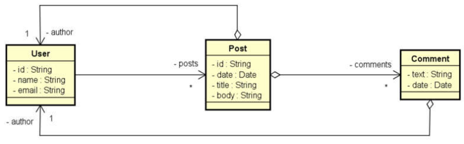

# Projeto - MongoDB com Spring Boot
[](https://github.com/Jefersonnnn/workshop-springboot3-jpa/blob/main/LICENSE)

# Sobre o projeto

Meu objetivo ao criar este projeto é aprimorar minhas habilidades no desenvolvimento de aplicações web utilizando Java, enquanto acompanho o curso [Java Completo 2023](https://www.udemy.com/course/java-curso-completo/).

Este repositório será uma referência constante para consultas futuras ao conteúdo apresentado.

## Objetivos
- Compreender as principais diferenças entre paradigma orientado a documentos e relacional
- Implementar operações de CRUD
- Refletir sobre decisões de design para um banco de dados orientado a documentos
- Implementar associações entre objetos
  - Objetos aninhados
  - Referências
- Realizar consultas com Spring Data e MongoRepository

## Modelo de domínio


# Tecnologias utilizadas
## Back end
- Java 17
- Spring Boot
    - Spring Web
- MongoDB
- Maven

# Como executar o projeto

## Back end
Pré-requisitos: 
- Java 17
- MongoDB


```bash
# clonar repositório
git clone https://github.com/Jefersonnnn/workshop-springboot-mongo.git

# executar o projeto
./mvnw spring-boot:run
```

# Autor

Jeferson Machado

[Prof. Nelio Alves](https://devsuperior.com.br/)